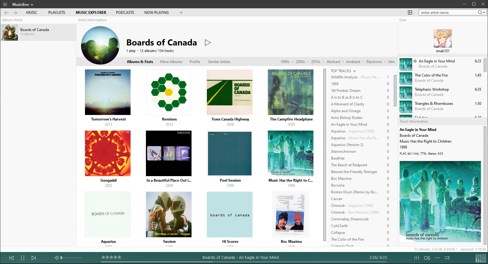
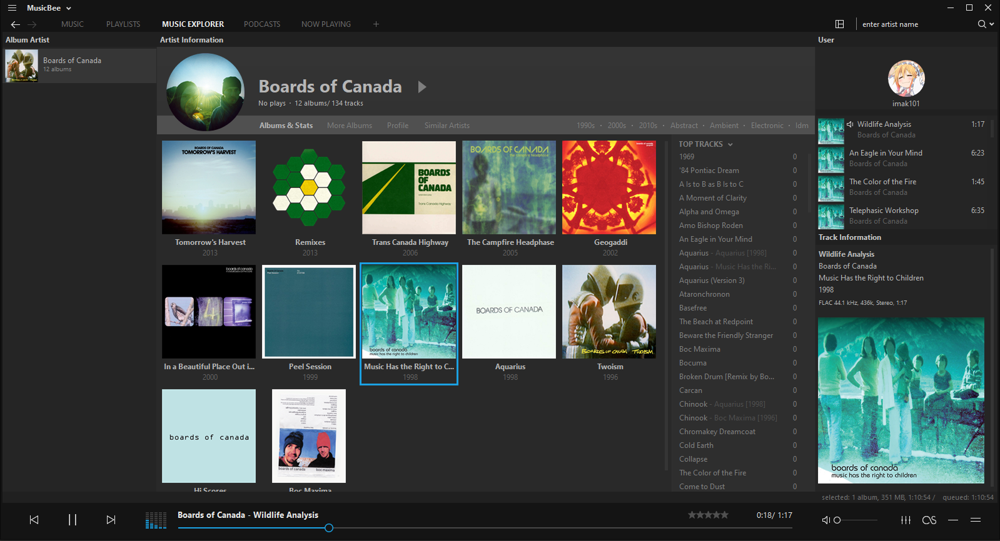

# MusicBeeSomething1 (title to change)

MusicBeeSomething1 is a [MusicBee](https://getmusicbee.com/) plugin that adds customizations options for the application. Mainly being a profile picture and username panel for the main player view, this plugin will also include various styling options for the said panel.

This plugin's current state is functional and stable enough to be released as an alpha. The current features are very limited so please check back often for new additions! 

# Features

- Add a picture and username to be displayed in an individual panel
- Option to round picture's corners

### TODO

- Add additional positioning options for username and picture
- Add custom color option for back and foreground
- Add greeting options
- Add GIF support(?)
- And more...

# Screenshots (as of v0.1.2)

##### The main panel

##### The panel on the top right of the main view

### Dark mode

